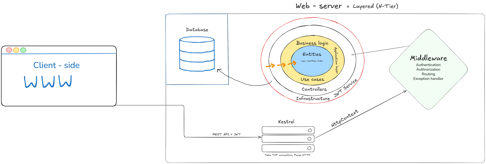

# IntraLink

**IntraLink** is a corporate social network for managing an organization - employee directory, personal pages, department and project team pages, news feed, and a corporate event calendar.


---

## Table of Contents

- [Tech Stack](#tech-stack)
- [Architecture](#architecture)
- [Project Structure](#project-structure)
- [Getting Started](#getting-started)
  - [Prerequisites](#prerequisites)
  - [Database Setup](#database-setup)
  - [Migrations](#migrations)
  - [Run the Server](#run-the-server)
  - [Run the Client](#run-the-client)

---

## Tech Stack

| Layer    | Technology                    |
|----------|-------------------------------|
| Backend  | ASP.NET Core Web API (.NET 8) |
| Frontend | Vue.js 3                      |
| Database | PostgreSQL                    |
| ORM      | Entity Framework Core 8       |

---

## Architecture

<p align="center">
  
</p>

---

## Project Structure

```
IntraLink/
├── server/
│   ├── Api/            # Controllers, DTOs, validators, entry point
│   ├── Application/    # Business logic: services, interfaces, use-cases
│   └── Data/           # DbContext and EF Core migrations
├── client/
│   └── intralink-frontend/   # Vue.js 3 SPA
├── docs/               # Architecture diagrams and project documentation
└── tests/              # Automated tests
```

---

## Getting Started

### Prerequisites

- [.NET 8 SDK](https://dotnet.microsoft.com/download)
- [PostgreSQL](https://www.postgresql.org/download/)
- [Node.js 20+](https://nodejs.org/) and npm

Install the EF Core CLI tool if not already available:

```powershell
dotnet tool install --global dotnet-ef
```

---

### Database Setup

> [!IMPORTANT]
> Never store passwords in source code. Use **User Secrets** for local development.

Run the following commands from the `server/Api` directory:

```powershell
dotnet user-secrets init
```

```powershell
dotnet user-secrets set "ConnectionStrings:DefaultConnection" "Host=localhost;Database=IntraLinkDb;Username=postgres;Password=YOUR_PASSWORD"
```

Replace `YOUR_PASSWORD` with your local PostgreSQL user password.

---

### Migrations

All migration commands must be run from the **repository root**.

**Create a new migration:**

```powershell
dotnet ef migrations add <MigrationName> --project server/Data/Data.csproj --startup-project server/Api/Api.csproj
```

**Apply migrations to the database:**

```powershell
dotnet ef database update --project server/Data/Data.csproj --startup-project server/Api/Api.csproj
```

**Roll back to a specific migration:**

```powershell
dotnet ef database update <PreviousMigrationName> --project server/Data/Data.csproj --startup-project server/Api/Api.csproj
```

---

### Run the Server

```powershell
dotnet run --project server/Api/Api.csproj
```

With hot reload:

```powershell
dotnet watch run --project server/Api/Api.csproj
```

> [!NOTE]
> Swagger UI will be available at `http://localhost:5038/swagger`. The port may vary — check the terminal output.

---

### Run the Client

```powershell
cd client/intralink-frontend
npm install
npm run dev
```

---

## License

Distributed under the [MIT License](./LICENSE).
